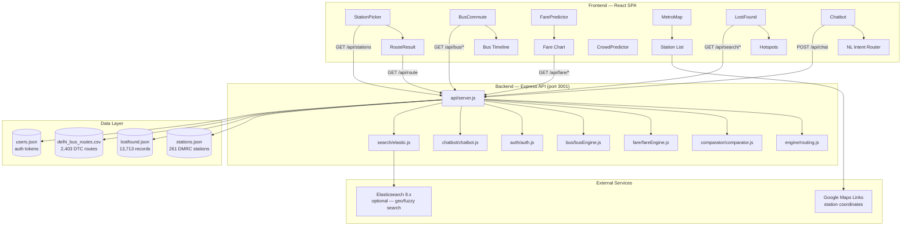
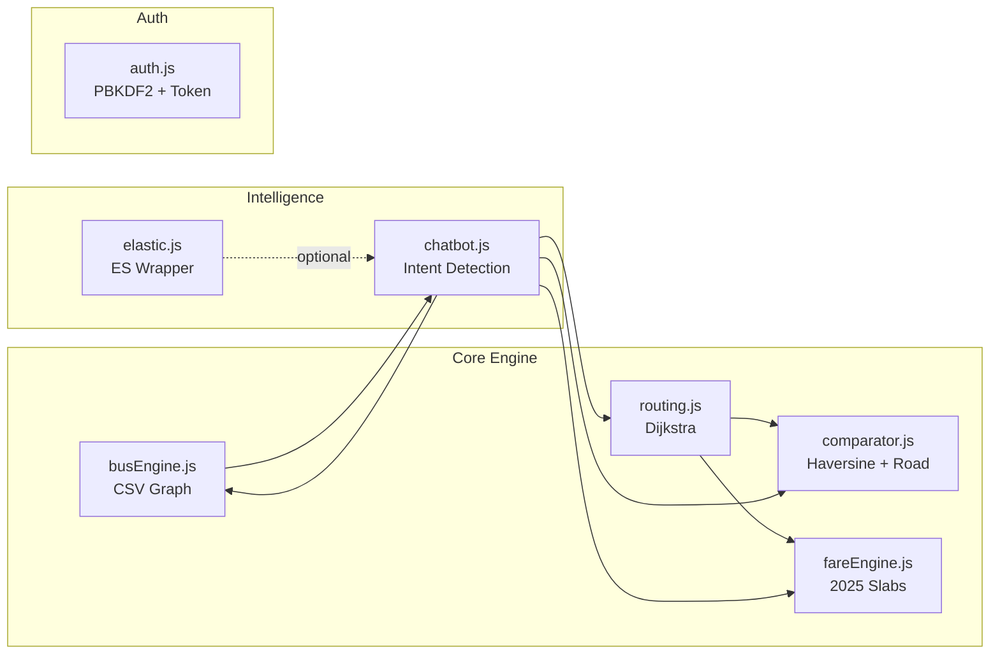

# Architecture

```mermaid
graph TB
    subgraph "Frontend — React SPA"
        A[StationPicker] --> B[RouteResult]
        C[BusCommute] --> D[Bus Timeline]
        E[FarePredictor] --> F[Fare Chart]
        G[MetroMap] --> H[Station List]
        I[LostFound] --> J[Hotspots]
        K[CrowdPredictor]
        L[Chatbot] --> M[NL Intent Router]
    end

    subgraph "Backend — Express API (port 3001)"
        direction TB
        N[api/server.js] --> O[engine/routing.js]
        N --> P[comparator/comparator.js]
        N --> Q[fare/fareEngine.js]
        N --> R[bus/busEngine.js]
        N --> S[auth/auth.js]
        N --> T[chatbot/chatbot.js]
        N --> U[search/elastic.js]
    end

    subgraph "Data Layer"
        V[(stations.json<br/>261 DMRC stations)]
        W[(lostfound.json<br/>13,713 records)]
        X[(delhi_bus_routes.csv<br/>2,403 DTC routes)]
        Y[(users.json<br/>auth tokens)]
    end

    subgraph "External Services"
        Z[Elasticsearch 8.x<br/>optional — geo/fuzzy search]
        AA[Google Maps Links<br/>station coordinates]
    end

    A -->|GET /api/stations| N
    B -->|GET /api/route| N
    C -->|GET /api/bus/*| N
    F -->|GET /api/fare/*| N
    I -->|GET /api/search/*| N
    L -->|POST /api/chat| N
    N --> V
    N --> W
    N --> X
    N --> Y
    U --> Z
    H --> AA
```

## Module Dependency Map

```mermaid
graph LR
    subgraph "Core Engine"
        R1[routing.js<br/>Dijkstra]
        R2[comparator.js<br/>Haversine + Road]
        R3[fareEngine.js<br/>2025 Slabs]
        R4[busEngine.js<br/>CSV Graph]
    end

    subgraph "Intelligence"
        C1[chatbot.js<br/>Intent Detection]
        E1[elastic.js<br/>ES Wrapper]
    end

    subgraph "Auth"
        A1[auth.js<br/>PBKDF2 + Token]
    end

    R1 --> R2
    R1 --> R3
    R4 --> C1
    C1 --> R1
    C1 --> R2
    C1 --> R3
    C1 --> R4
    E1 -.->|optional| C1
```
