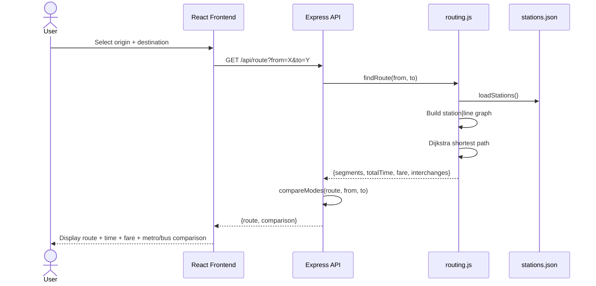
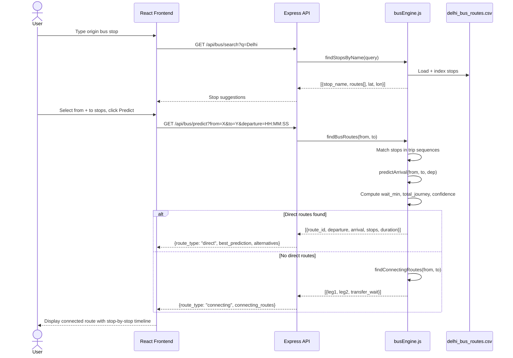
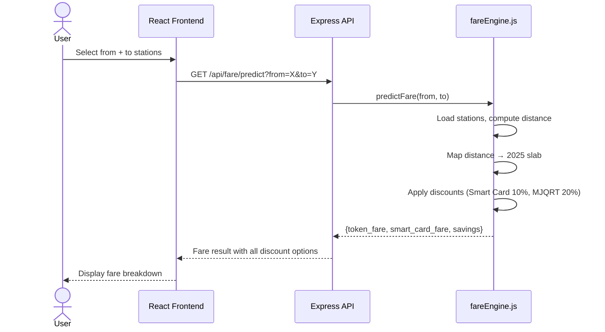
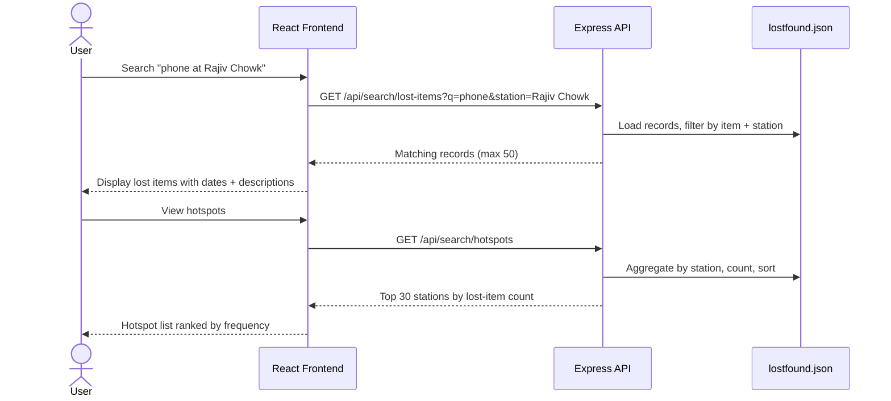
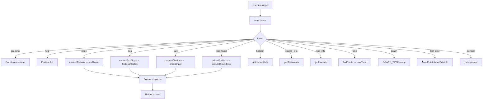
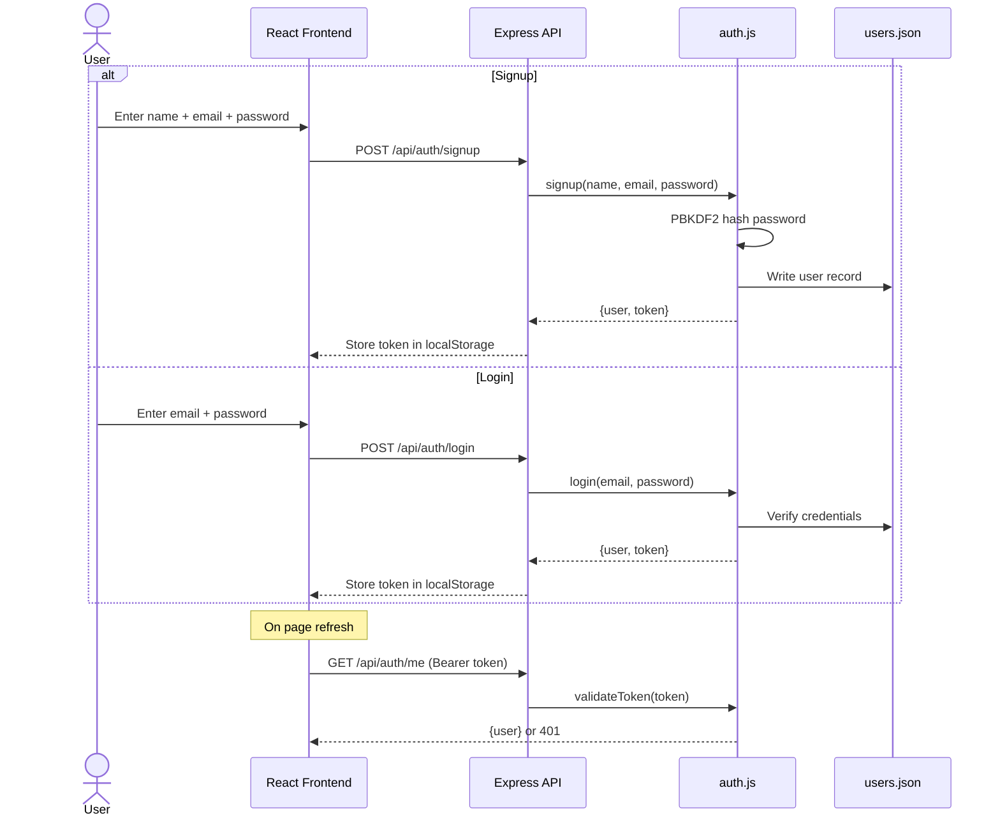

# Workflows

## Metro Route Planning

```mermaid
sequenceDiagram
    actor User
    participant FE as React Frontend
    participant API as Express API
    participant RT as routing.js
    participant DB as stations.json

    User->>FE: Select origin + destination
    FE->>API: GET /api/route?from=X&to=Y
    API->>RT: findRoute(from, to)
    RT->>DB: loadStations()
    RT->>RT: Build station|line graph
    RT->>RT: Dijkstra shortest path
    RT-->>API: {segments, totalTime, fare, interchanges}
    API->>API: compareModes(route, from, to)
    API-->>FE: {route, comparison}
    FE-->>User: Display route + time + fare + metro/bus comparison
```

## DTC Bus Route Search

```mermaid
sequenceDiagram
    actor User
    participant FE as React Frontend
    participant API as Express API
    participant BUS as busEngine.js
    participant CSV as delhi_bus_routes.csv

    User->>FE: Type origin bus stop
    FE->>API: GET /api/bus/search?q=Delhi
    API->>BUS: findStopsByName(query)
    BUS->>CSV: Load + index stops
    BUS-->>API: [{stop_name, routes[], lat, lon}]
    API-->>FE: Stop suggestions

    User->>FE: Select from + to stops, click Predict
    FE->>API: GET /api/bus/predict?from=X&to=Y&departure=HH:MM:SS
    API->>BUS: findBusRoutes(from, to)
    BUS->>BUS: Match stops in trip sequences
    BUS->>BUS: predictArrival(from, to, dep)
    BUS->>BUS: Compute wait_min, total_journey, confidence
    alt Direct routes found
        BUS-->>API: [{route_id, departure, arrival, stops, duration}]
        API-->>FE: {route_type: "direct", best_prediction, alternatives}
    else No direct routes
        BUS->>BUS: findConnectingRoutes(from, to)
        BUS-->>API: [{leg1, leg2, transfer_wait}]
        API-->>FE: {route_type: "connecting", connecting_routes}
    end
    FE-->>User: Display connected route with stop-by-stop timeline
```

## Fare Prediction

```mermaid
sequenceDiagram
    actor User
    participant FE as React Frontend
    participant API as Express API
    participant FARE as fareEngine.js

    User->>FE: Select from + to stations
    FE->>API: GET /api/fare/predict?from=X&to=Y
    API->>FARE: predictFare(from, to)
    FARE->>FARE: Load stations, compute distance
    FARE->>FARE: Map distance → 2025 slab
    FARE->>FARE: Apply discounts (Smart Card 10%, MJQRT 20%)
    FARE-->>API: {token_fare, smart_card_fare, savings}
    API-->>FE: Fare result with all discount options
    FE-->>User: Display fare breakdown
```

## Lost & Found Search

```mermaid
sequenceDiagram
    actor User
    participant FE as React Frontend
    participant API as Express API
    participant DATA as lostfound.json

    User->>FE: Search "phone at Rajiv Chowk"
    FE->>API: GET /api/search/lost-items?q=phone&station=Rajiv Chowk
    API->>DATA: Load records, filter by item + station
    API-->>FE: Matching records (max 50)
    FE-->>User: Display lost items with dates + descriptions

    User->>FE: View hotspots
    FE->>API: GET /api/search/hotspots
    API->>DATA: Aggregate by station, count, sort
    API-->>FE: Top 30 stations by lost-item count
    FE-->>User: Hotspot list ranked by frequency
```

## Chatbot Flow

```mermaid
flowchart TD
    A[User message] --> B[detectIntent]
    B --> C{Intent}
    C -->|greeting| D[Greeting response]
    C -->|help| E[Feature list]
    C -->|route| F[extractStations → findRoute]
    C -->|bus| G[extractBusStops → findBusRoutes]
    C -->|fare| H[extractStations → predictFare]
    C -->|lost_found| I[extractStations → getLostFoundInfo]
    C -->|hotspot| J[getHotspotInfo]
    C -->|station_info| K[getStationInfo]
    C -->|line_info| L[getLineInfo]
    C -->|time| M[findRoute → totalTime]
    C -->|coach| N[COACH_TIPS lookup]
    C -->|last_mile| O[Auto/E-rickshaw/Cab info]
    C -->|general| P[Help prompt]
    F --> Q[Format response]
    G --> Q
    H --> Q
    I --> Q
    Q --> R[Return to user]
```

## Auth Flow

```mermaid
sequenceDiagram
    actor User
    participant FE as React Frontend
    participant API as Express API
    participant AUTH as auth.js
    participant FS as users.json

    alt Signup
        User->>FE: Enter name + email + password
        FE->>API: POST /api/auth/signup
        API->>AUTH: signup(name, email, password)
        AUTH->>AUTH: PBKDF2 hash password
        AUTH->>FS: Write user record
        AUTH-->>API: {user, token}
        API-->>FE: Store token in localStorage
    else Login
        User->>FE: Enter email + password
        FE->>API: POST /api/auth/login
        API->>AUTH: login(email, password)
        AUTH->>FS: Verify credentials
        AUTH-->>API: {user, token}
        API-->>FE: Store token in localStorage
    end

    Note over FE: On page refresh
    FE->>API: GET /api/auth/me (Bearer token)
    API->>AUTH: validateToken(token)
    AUTH-->>FE: {user} or 401
```
